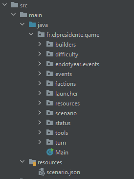

##Outils & techniques de développement - Projet final
| Année     | Auteur           | Version                   |
| --------- | ---------------- | ------------------------- |
| 2020/2021 | Thomas Domingues | tdomingues@myges.fr 1.0.0 |
***

##Objectifs
Le but de ce projet est de faire un jeu vidéo à la croisée entre Tropico et Reigns. Vous incarnerez
un jeune dictateur en herbe sur une île tropicale, fraîchement
élu comme Président. Vous aurez la lourde tâche de faire prospérer cette nouvelle mini-
république.

# Introduction

Note technique rédigé dans le cadre du projet pédagogique d'Outils et techniques de developpement.

Cette note a pour but de détailler notre architecture, nos choix d’implémentation et décrire nos algorithmes & design patterns

# Architecture

## Packages

Pour ce projet nous avons adopté l'architecture suivante pour nos packages JAVA:

Nous avons donc décidé de regrouper nos classes dans différents packages, ce qui nous pemet de rendre certaine classes visible dans le package uniquement et d'autres publiques pour réduire les dépendances chaotique.

## Classes

Concernant l'architecture des classes, nous avons rapidement identifié des systèmes qui devraient êtres gérés de manière indépendante à des endroits différents du code.

Par exemple pour l'argent, l'industrie pourra en ajouter au même titre que les évènements, nous sommes donc partie sur un système de controller afin de pouvoir centralliser les intéractions entre les classes.

# Design Patterns

Pour ce projet nous allons détailler les design patterns que nous avons retenu en expliquant pourquoi et comment nous les avons mis en places.

## Singleton

Le singleton est un design pattern qui permet de s'assurer qu'il n'éxiste qu'une seule et unique instance d'une classe précise.

Dans notre cas, nous avons retenu ce design pattern pour le fonctionnement des classes `DifficultyController`, `EventController`, `FactionController`, `ConsumableController` et `ResourceController`.

L'avantage du singleton dans ce cas est de s'assurer que nous appelerons toujours la même instance de la classe et ce depuis n'importe quel endroit du code.

Cela nous évite de passer les bonnes instances des classes en paramètres via des setter/getter ou autre, déchargeant ainsi le reste du code et le rendant moins complexe.

Cependant, les Singleton ne doivent pas êtres utilisés de manière abusive sinon ils témoignent d'une mauvaise architecture, nous avons donc limité leur utilisation à des controllers qui vont servir de point de passage pour le traitement d'informations.

Ces controllers étant appelés à différents endroits du code, il est donc important de toujorus récupérer la même instance de ces derniers, ce qui explique notre choix du Singleton.

## Contrôleur (Mediator)

Le Controleur est un design pattern qui a pour but de centraliser le traitement des informations, afin d'éviter que les dépendances chaotiques entre les objets.

Dans notre cas, nous avons retenu ce design pattern pour le fonctionnement des classes `DifficultyController`, `EndOfYearController`, `EventController`, `FactionController`, `ConsumableController`, `ResourceController` et `TurnController`.

D'un point de vue fonctionnel, cela nous a permis de réduire les dépendances dans notre code en passant par un controller plutôt que par les classes directement.

En couplant certains controller au design pattern Singleton, nous nous assurons d'avoir toujours la bonne instance de notre controller et ce n'importe où dans notre code.

Nous avons aussi profité de ce design pattern pour réduire la visibilité de certaines classes en ne les rendant visibles que par le controller, les protegeant ainsi de toute modification externe au package sans appel du controller.

## Builder

## Répartition des partisans

Pour le bonus la répartition des partisans on a décidé d'utiliser un Singleton pour créer un Controller et ainsi pouvoir appelé la classe sans l'instancier au début du jeu et ainsi pouvoir tout au long du jeu avoir le même algorithme. En effet graçe à l'interface SupportersDistribution on peut rajouter des algorithmes de répartition très facilement e, créant une classe implémentant SupportersDistribution puis en ajoutant dans SupportersDistributionController l'instanciation de notre nouvel sorte d'algorithme en fonction de la valeur dans le json de supporters_distribution.
Pour l'algorithme equilibrate on va distribuer les partisans en fonction du pourcentage de satisfaction de chaque factions et de son rapport avec le pourcentage de satisfaction global. une faction ne contenant que 10 Partisans ne pourra avoir plus de 5 nouveau partisan à la fin de l'année, une faction ayant 0% de satisfaction ne pourra avoir de nouveaux partisans. Les factions ayant le plus de satisfaction seront les premières factions ayant de nouveaux partisans car plus heureuses.